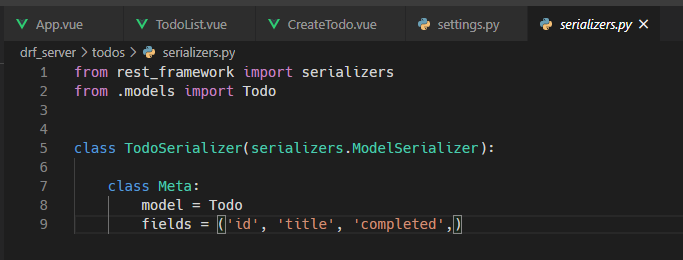
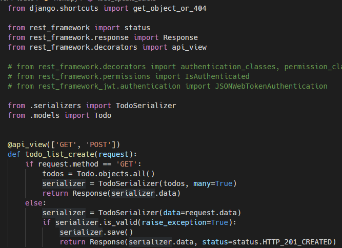
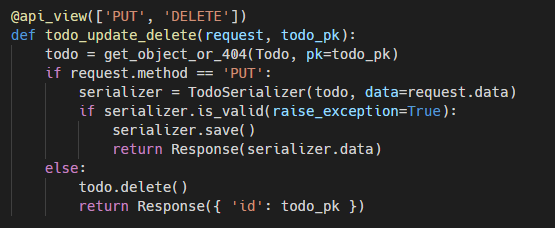
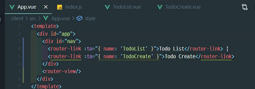
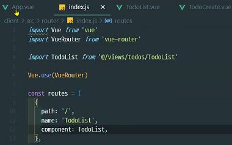

## Server & Client

### Django

server라는 폴더 안에

- 가상환경 만들기 (`pythn -m venv venv`)4
  - 가상환경 python 잡아주기 (`source venv/Script/activate`)
- `pip install django`

- 장고 프로젝트 생성 (`django-admin startproject config .`)

- `python manage.py startapp todos`
- 앱설정 ,url, todos의 url, models.py (DB생성)
  - makemigrations , migrate 진행하기

- restframework 설치 및 등록

- serializers.py작성

  - `form rest_framework import serializers` 로 등록하기

    

- views.py 작성을 통해 CRUD 해당 로직 적어주기

  - GET : 조회

  - POST : 생성

    

    - GET

      - serializer가 하나가 아니기 때문에 many=True넣어주기

    - POST

      -  serializer에서 data= 값 꼭! 넣어워야 한다.
      - raise_exception=True 하지 않으면 유효성 통과하지 못하면 왜 실패 했는지 에러페이지 말고 응답으로 나타내준다.

    - Response를 통해 응답을 보내줘야 한다.

      

  - PUT : 업데이트, 수정

  - DELETE : 삭제

    

### Vue

`vue create client`

- helloworld에 해당하는 부분삭제

- `router`를활용하기 때문에 `vue add router`하기

  

- router/index.js 

  - path,name,componenet 작성하기

    

  - *PostMan으로 더미 데이터 생성겸 CR에 대당하는 부분 확인해보기*

  

- views/todos/

  

  - 컴포넌트 vue생성후 기본적인 뼈대 잡아주기
  - TodoList.vue
    - 버튼 클릭시 데이터 생성
    - `npm i axios`설치하고 import하기 `import axios from 'axios'`
    - getTodo
      - axios.get(url)
      - ,then(res), .catch(err)
    -  django에 cors hearders 설치 > Installed apps에 등록 > middleware 제일 위헤 하기 > 허용 오리진 등록 (주소입력 , 정규표현식, *)
  - TodoCreate.vue


#### JWT 토큰

- Login.vue 만들고 형태 만들기

- Signup.vue 만들고 형태 만들기

- 두 vue를 index.js에 등록하기 >  app에 router나타내기

- Singup.vue template 채우기 (username,password,passwordConfirmation)

  - `credentials` object로 v-model 구성

    ```vue
    data: function () {
        return {
          credentials: {
            username:'',
            password:'',
            passwordConfirmation:'',
          }
        }
      },
    ```

  - `signup`함수 만들기 - 서버에 회원가입 요청

    ```vue
    methods: {
        signup: function () {
          // console.log(credentials)
          axios.post(`${SERVER_URL}/accounts/signup/`,this.credentials)
          .then((res)=> {
            console.log(res)
            this.$router.push({ name:'Login' })
          })
          .catch((err) => {
            console.log(err)
          })
        }
      }
    ```

- `python manage.py startapp accounts` 회원가입하는 app 만들기

- urls include > accounts/urls > 

- User model coustom 하기 > todos.model에 user 가져오기 ForeignKey > settings에서 `AUTH_USER_MODEL = 'accounts.User'` 등록하기

  - *related_name= 역참조*

- 모델 두개를 생성했기 때문에 기존 db, migration 지우고 다시 migartions, migrate 진행하기

- django signup할 준비 (=views.py/signup 작성하기)

  - 데이터를 받고 , 유효성 검사하고, 유저정보 생성하기

  - but, 유효성 검사하가 위해 serializers.py 파일을 만들어서주기

    ```python
    from rest_framework import serializers
    from django.contrib.auth import get_user_model
    
    User = get_user_model()
    
    class UserSerializer(serializers.ModelSerializer):
        password= serializers.CharField(write_only=True) 
        //password는 보이면 안되기 때문에 write_only로 가려주기
        class Meta:
            model = User
            fields = ('username','password',)
    ```

- Signup.vue 작성해서 요청하고 응답 받은 후 로그인 하기

- Login.vue 작성

  - JWT (출입증)을 만들기 위해 server 로 이동

  - jwt 설치하기 install

  - accounts/urls.py에 설정하기

    ```python
    from django.urls import path
    from . import views
    
    from rest_framework_jwt.views import obtain_jwt_token
    
    urlpatterns = [
        path('signup/', views.signup),
        path('api-token-auth/',obtain_jwt_token),
    ]
    ```

  - JWT_AUTH의 시간을 5분에서 시간 늘려주기 (=출입증 유효기간 늘려주기)

    ```python
    # settings.py
    import datetime
    #jwt additional settings
    JWT_AUTH={
        'JWT_EXPIRATION_DELTA': datetime.timedelta(days=1),
    }
    ```

    