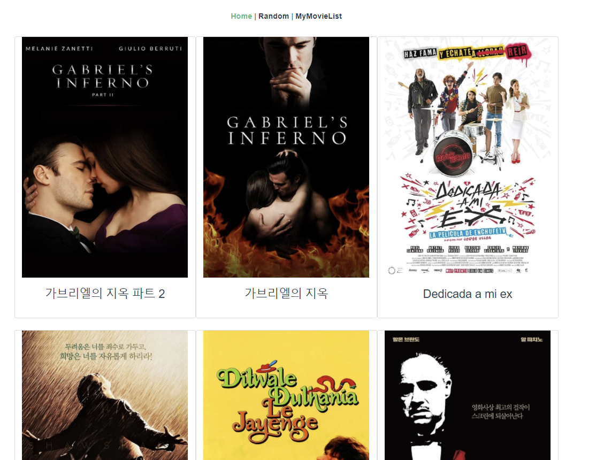
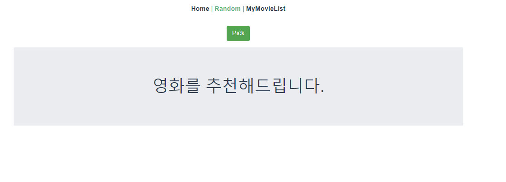
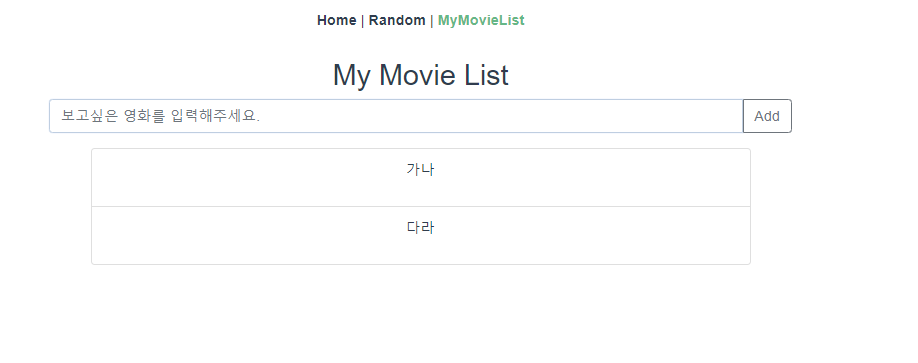
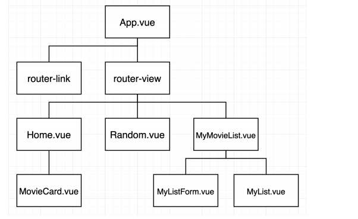
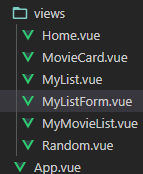
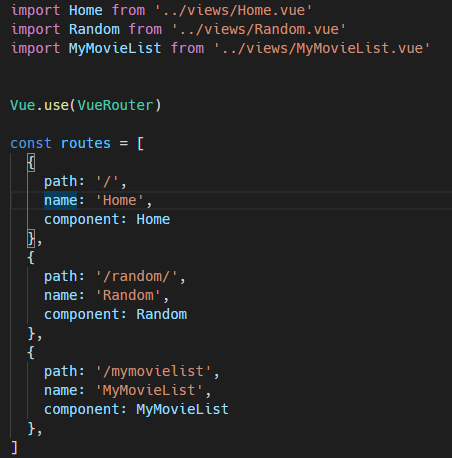

#### 영화 목록



- Home.vue는 부모로 밑의 자식인 MovieCard에 movie의 데이터를 porps해주었다,
- 데이터는 axios를 통해 받았고 `v-for`를 통해 movie 데이터를 구성하였다. 
- **MovieCard.vue** 를 통해 각 데이터의 포스터 사진, 제목, 줄거리를 담고 있는 카드를 만들었다.

***


#### 영화 랜덤 추천



- axios를 통해 영화 데이터가 JSON데이터를 받아왔다.

- loadash의 samplesize를 활용하여 100개의 데이터중 1개의 영화를 랜덤으로 선정하였다,

  ```vue
  this.movie = _.sampleSize(res.data, 1)
  ```

- `ismovie`의 true/false를 통해 첫 화면에서 movie의 값이 없을떄 오류가 발생하지 않게 하였다.
  
  - 그냥 단순히 하나의 값을 렌더링 한다고 작성했을 때 movie에 아무 값이 없을 때 오류가 발생했다. 그래서 ismovie의 기본 값을 false로 두고` true일때` 추천 영화를 보이게 만들어 주었다.

***


#### 보고 싶은 영화 리스트



- MymovieList를 기준으로 밑에는 입력창을 담고 있는 MyListForm과 입력한 리스트를 담고 있는 MyList 두 개의 컴포넌트가 존재하고 있다.

- ```vue
  // MymovieList에는 두개의 컴포넌트가 보일 수 있게 template을 신경써 주었다.
  <template>
    <div>
      <h2>My Movie List</h2>
  
      <MyListForm/>
      <MyList/>
    </div>
  </template>
  ```

- **MyListFrom**

  - Vuex를 활용하여 진행하였다. 먼저 mymovie 데이터를 input과 v-model로 양방향 통신을 이루었다. 얻은 데이터를 title의 value값으로 할당하고 inputItem을 `dispatch`를 통해 Actions에 절달해 주었다.

  ```vue
  <script>
  export default {
    name: 'MyListForm',
    data: function () {
      return {
        mymovie: '',
      }
    },
    methods: {
      addMyMovie: function () {
        const inputItem = {
          title: this.mymovie
        }
        if (inputItem.title) {
          this.$store.dispatch('addMyMovie', inputItem)
        }
        this.mymovie=''
      }
    }
  }
  </script>
  ```

  - Actinos는 commit을 통해 직접 데이터를 다룰 수 있는 method를 가진 mutations에 알려주었다.

  ```vue
  export default new Vuex.Store({
    state: {
      mymovies: [],
    },
    mutations: {
      ADD_MYMOVIE: function (state, inputItem) {
      state.mymovies.push(inputItem)
      }
    },
    actions: {
      addMyMovie: function ({ commit }, inputItem) {
        commit('ADD_MYMOVIE', inputItem)
      }
    },
    modules: {
    }
  })
  
  ```

- **MyList**

  - ...mapState를 활용하여 vuex의 특징인 한곳에 저장되어 있는 데이터 State에 접근할 수 있다. 불러온 데이터를 `v-for`를 통해 입력한 데이터를 하나하나 꺼내왔다.

  ```vue
  <template>
    <div>
      <ul class="list-group" style="list-style-type:none;">
        <li class="list-group-item col-8 offset-2 completed" v-for=" (movie, idx) in mymovies"
        :key="idx">
        <p>{{ movie.title }}</p>
        </li>
      </ul>
    </div>
  </template>
  
  <script>
  import { mapState } from 'vuex'
  
  
  export default {
    name: "MyList",
  
    computed: {
      ...mapState([
        'mymovies'
      ])
    }
  }
  ```

  

***






- 컴포넌트 구조 사진을 보고 컴포넌트 파일 생성뿐 아니라 부모 자식간 역결을 진행했다.

### router

- router는 크게 Home, Random, MyMovieList 3가지로 나누어 작성하였다.



***


## 느낀점

```
vue와 vuex , ajax와 axios 등 배웠던 개념이 모두 모아둔 프로젝트를 진행할 떄 개념이 떠오르지 않아 당황했다. 개별적으로 진행했을 때 이해했다 라고 생각했었는데 막상 적용하여 진행하려니 제일 최근에 했던 개념만 생각이 났다.
결국 교수님께 물어보며 기억을 복기했다. 2학기의 프로젝트를 위해서라도 최종프로젝트를 했다에서만 끝난게아니라 지속적인 학습을 통해 나의 지식으로 만들기 위해 노력해야겠다.
```

