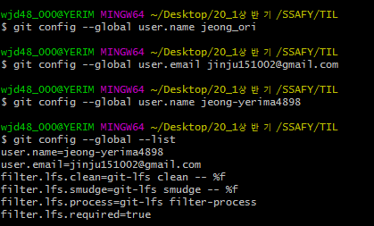
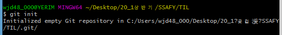
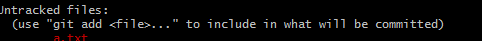
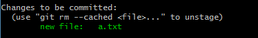
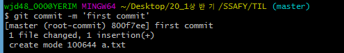
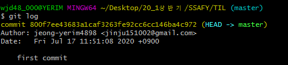

- 절대경로 : C:\users\ 같은형식
- 상대경로 : 현재 위리치를 기준으로 접근하는 형태
- 로컬에 이미지파일을 저장한 경우 절대 경로가 아닌 상대 경로를 사용하여 이미지를 저장
  - 현재 보는 마크다운.md 파일이 c:\users\Edwin에 있다고 가정
  - 예시 : ./download => 절대경로 c:\users\Edwin\download
    - `.` : 현재폴더
    - `..` : 상위폴더 ../download =>절대경로 `c:/users/download`

- word처럼 이미지가 파일내부에 저장되는 형태가 아닌점을 주의

#### 1.6 Table

- `|` (파이프)사이에 컬럼을 작성하고 enter를 입력합니다.


**check box**

- [ ] 가나다

`- [ ] task list item`


- Git bash 설치


# Git

 **분산 버전 관리 시스템 **

> 코드의 History를 관리하는 도구 개발된 과정과 역사를 볼수 있으며 프로젝트의 이전 버전을 복원하고 변경사항을 비교, 분석 및 병합도 가능하다.

**DVCS(Distributed Version Control System)**


*add* 커밋할 목록에 추가

*commit* 커밋(create a snapshot) 만들기

*push* 현재까지의 역사(commits)가 기록되어 있는 곳에서 생성한 커밋들 반영하기


```git
$ git add helloworld.py

$ git commit -m

$ git config --global user.name "John"
```

- commit을 할때 log를 같이 적어준다.


- config는 git설치 후 최초1번/commit을 할때 누가 했는지 알수 있는 역할
  - 자리를 옮기면 매번 설정해줘야 한다.

*tensorflow github*

*개발자의 이력서 & 연습장*

**TIL은 아는만큼 직접 적어야 한다. 나중에 좋다. 매일 작성하는 버릇을 들이는게 좋다**

~~gitlab은 괜찮지만 github는 유의해서 정리해서 올리기~~

~~싸피 범위 아닌 한에 올리는거 가능~~

#### git이 관리한 코드(서버를 제공해주는 서비스)

- github 
- gitlab
- gitbucket

- git은 gui를 제공하는 툴(SourceTree,GitHub Desktop,GitKraken..)도 있다. 터미널에서 명령어로만 작업할 수 있지 않다.

   -> 터미널로만 할 수 있는 경우가 있기 때문이다.

   -> 조금 더 섬세하다. 그래서 5.5개월 정도는 터미널을 활용해서 git을 한다.

- 



- **.git의 용도**

  - TIL을 git으로 관리한다.

  - 폴더 내부도 git으로 동일하게 관리한다.

  - `git status` git 상태가 변화되었는지 확인하는 명령어

  - 

    데이터베이스에 없는 파일

  - `git add 파일이름` 올렸다.
  - 

  - `esc`+`:` -> `q` 입력하고 엔터 그래도 안나가면 `!` 붙이기
  - 
  - **commit 완료**
  - 
  - **git log 확인 가능**
  - `shift + insert` 붙여넣기
  - `git add .` 현재 폴더를 staging area에 다 올리겠다.
  - `git reset or restore` add한거 빼기

- 중요해서 git에 올릴필요가 없는 파일이 있다.
  - blacklist를 만들어 그외의 파일을 git에 올린다.
  - `$echo > .gitignore`
  - .gitignore파일안에 올리고 싶지 않은 파일이름 명을 적고 `git stauts`를 치면 상태에 안뜬다.


- 싱크 맞추는게 중요하다. 아니면 100프로 error가 뜬다.

- terminal gitbash 형식으로 바꾸기 (Select default shell)
  - 상단에 gitbash  선택하기
- **외장모듈 2가지 종류**
  - 파이썬이 기본적으로 제공하는 외장모듈(책상서랍에 위치)
  - 다른 사람이 만들어둔 외장모듈(문구점에 사러가야 한다.)\
    - `pip`툴을 이용해서 외장모듈을 설치
    - `import` 하고 사용한다.

####  웹크롤링을 위한 외장모듈

**1. requests**

- 간편한 http 요청처리기가 들어있는 모듈이다.

- 설치하는 방법

  `pip install requests` 

**2. beautiful soup**

- 텍스트로 나타나는 html을 우리가 사용하기 쉽게 바꿔주는 역할을 하는 모듈
- 설치가 필요함
  - `pip install beautifulsoup4`

- 파이썬 내장 함수인 json을 활용해서 json->Dictionary형태로 변환해서 사용

#### 웹 크롤링 & API통신의 큰 흐름

1. url로 요청을 한다.
2. 받은 응답을 가지고 원하는 데이터를 가지고 온다.

*다음에서 인기 검색어를 클로링해서 보여주는 결과*

*kospi.py랑 비슷하다*

![image-20200717160122459](튜토리얼_1.assets/image-20200717160122459.png


